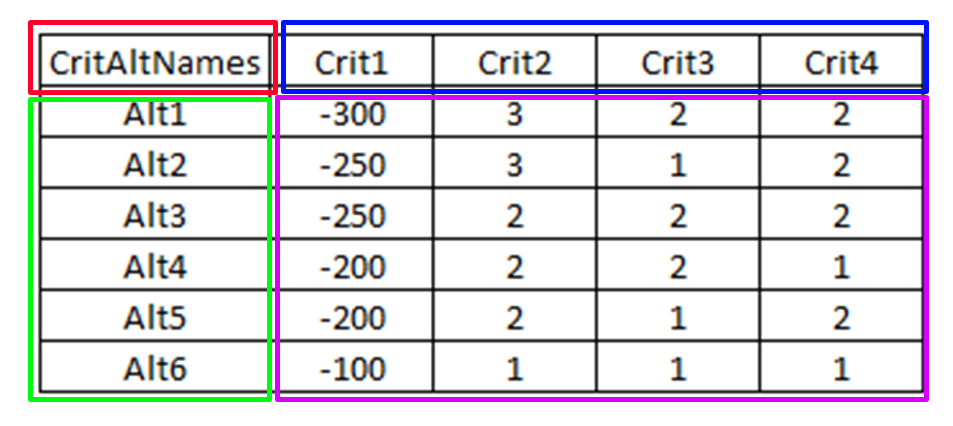

# electre-1-3-python-app

This is the Python application that I created doing my thesis studying Industrial Engineering and Management in Democritus University of Thrace. It contains all the files as long as a download link to the standalone executable.

## Table of Contents

- [Installation](#installation)
- [Usage](#usage)
- [Contributing](#contributing)
- [License](#license)
- [Contact](#contact)
- [Acknowledgments](#acknowledgments)
- [Dependencies](#dependencies)

## Installation

This application is for windows only.  

### Easy method

If you have a bit of space in your local pc, the easiest way is to
download the executable (.exe) from [here](https://drive.google.com/drive/folders/1xnjbDru3DSmCGgLhKelJPijLfAmJj0mn?usp=sharing).  

There are 2 alternatives, one is windowed mode, **OptimizeIt.exe**, - no console at all - and the second is a consoled version, **OptimizeIt_db.exe**, - there is still the window and the console additionally - for bebugging reasons.  

Then, jsut download the folder *__"content"__* and place it in the same folder as the executable.  

That's it! Now you can run it normally, by double clicking the executable.

### Second method

This method is done by cloning the repo in your local machine.

Requres a Python installation to your pc, preferably _Python v3.10.10_ which was the version that this application was developed at. It is also required to have Git installed.

First, open the terminal and navigate to the folder you want to install the application.

Then, clone the repo, runing:

```bash
git clone https://github.com/nikosbeskos/electre-1-3-python-app
```

When the download is complete, it is recomended to create a Python virtual environment so that there is a clean Python installation for the application:

```bash
python -m venv <your-venv-name>
```
Then you can activate the venv using:

```bash
<your-venv-name>\Scripts\Activate.ps1
```
and deactivate it using:
```bash
deactivate
```

For running the app, it is recomended to be in an active Python venv. Then, it is needed to install the requred Python libraries, so run:

```bash
pip install -r requirements.txt
```
That's it! now you can run the application. To run it, use an IDE or a debuger to run the *__main.py__* or run in the terminal:

```bash
python main.py
```

## Usage

Since it has a GUI developed, usege is easy and self explanatory.

If you have selected to install it via the first method, just double click the executable and you re on.

If you selected to install it via the second method, you can use an IDE of your choice to navigate to the installation folder and run *__main.py__* . Another way to run it, is through the terminal. navigate to the installation folder, and run:
```bash
python main.py
```

The way it works, is by using an excel spreadsheet that has a particular form, like this:





> [!IMPORTANT]
>The requirements of the excel spreadsheet are:
>* It has to be of the filetype **"\<filename>.xlsx"** .
>* The application will only read from the first sheet of the file, if it has multiple sheets.
>* The sheet must be empty, and only contain the data of the MCDA decision problem's Decision Matrix, i.e. names of the criteria, names of the alternatives and their values for each criterion.
>* Data must be in a matrix where the fisrt column is the column of the **alternatives's names**, and the first row is the row of the **criteria names**, just like it is shown in the green and blue marked area in the image above. The rest of the cells are filled with the values of the decision problem.
>* First cell of the matrix **CANNOT** be empty. it doesnt matter what value it has.
>* Two samples of how should the excel file be are [here](Book_electre1.xlsx) for ELECTRE I, and [here](Book_electre3.xlsx) for ELECTRE III.


## Contributing

This code was developed for my Diploma thesis of my master's degree in Industrial Engineering and Management of the Engineering Department of Democritus University of Thrace, located in Xanthi, Greece. Any furhter commenting or help regarding the application and its evolution would be much appreciated and considered positively.

## License

This project is licensed under the BSD 3-Clause License. License can be found [here](LICENSE.md).

## Contact

Contact:
- [nikosbeskos@hotmail.com](mailto:nikosbeskos@hotmail.com)
- [nikosbeskosc@gmail.com](mailto:nikosbeskosc@gmail.com)

## Acknowledgments


We would like to express our gratitude to the following individuals, projects, and organizations for their contributions, support, and inspiration:

- [Athanasios P. Vavatsikos](https://apvavatsikos.wordpress.com/)
  - I would like to express my gratitude to Professor Athanasios P. Vavatsikos for his guidance and support throughout the entire process of my thesis and this project which is part of it. Their expertise, patience, and commitment to academic excellence have been instrumental in the successful completion of this work.
  
- [Anastasia Saridou](https://robotics.pme.duth.gr/asaridou/)
  - Special thanks to Anastasia Saridou for her expertise and help through this project's code development

- [Open Source Libraries and Frameworks used in this project](#dependencies)
  - I am sincerely thankful for the generous contributions, and I acknowledge the collective effort of the open-source community.

- Friends who helped with their "eye" for nice-looking visuals and colors in this project's GUI development.

I thank each of these contributors, whether through code, ideas, or other forms of support, for their invaluable contributions to the project.


## Dependencies

- [Matplotlib](https://matplotlib.org/)
  - License: [PSF-2.0 License](https://matplotlib.org/stable/users/project/license.html#license)
  - Copyright © [2002–2012 John Hunter, Darren Dale, Eric Firing, Michael Droettboom and the Matplotlib development team; 2012–2023 The Matplotlib development team](https://matplotlib.org/stable/users/project/license.html#copyright-policy)

- [NetworkX](https://networkx.org/)
  - License: [BSD 3-Clause License](https://networkx.org/documentation/stable/index.html#license)
  - Copyright © [2004-2023, NetworkX Developers](https://networkx.org/documentation/stable/index.html)

- [NumPy](https://numpy.org/)
    - License: [BSD-3-Clause License](https://github.com/numpy/numpy/blob/main/LICENSE.txt)
    - Copyright © [2005-2023, NumPy Developers](https://numpy.org/)

- [openpyxl](https://openpyxl.readthedocs.io)
    - License: [MIT License](https://foss.heptapod.net/openpyxl/openpyxl/-/blob/branch/3.1/LICENCE.rst)
    - Copyright © [2010 - 2023, Eric Gazoni, Charlie Clark](https://openpyxl.readthedocs.io)

- [Pandas](https://pandas.pydata.org/)
    - License: [BSD-3-Clause License](https://github.com/pandas-dev/pandas/blob/main/LICENSE)
    - Copyright © [2023 pandas](https://pandas.pydata.org/)

- [PySide6](https://www.qt.io/qt-for-python)
    - License: [LGPL Version 3](https://www.qt.io/licensing)
    - Copyright © [2023 The Qt Company Ltd](https://www.qt.io/group)

- [SciPy](https://scipy.org/)
    - License: [BSD-3-Clause](https://github.com/scipy/scipy/blob/main/LICENSE.txt)
    - Copyright © [2001-2002 Enthought, Inc. 2003-2023, SciPy Developers](https://scipy.org/)

- [tqdm](https://tqdm.github.io/)
    - License: [MPL-2.0 AND MIT](https://github.com/tqdm/tqdm/blob/master/LICENCE)
    - Copyright © [2023, Tqdm Developers](https://tqdm.github.io/)